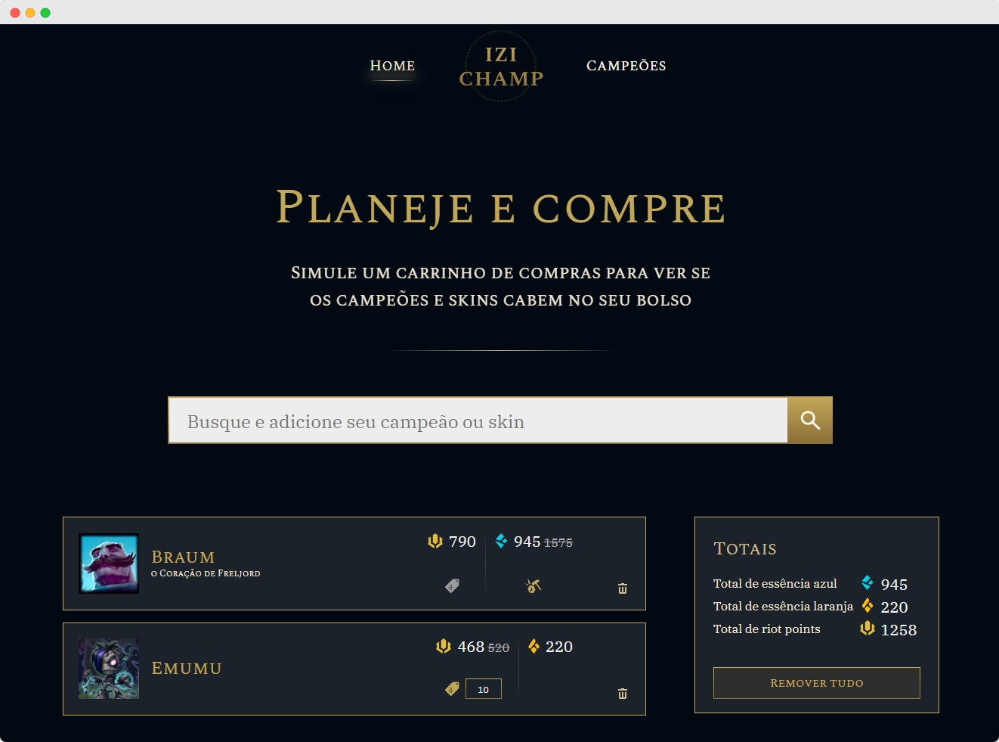
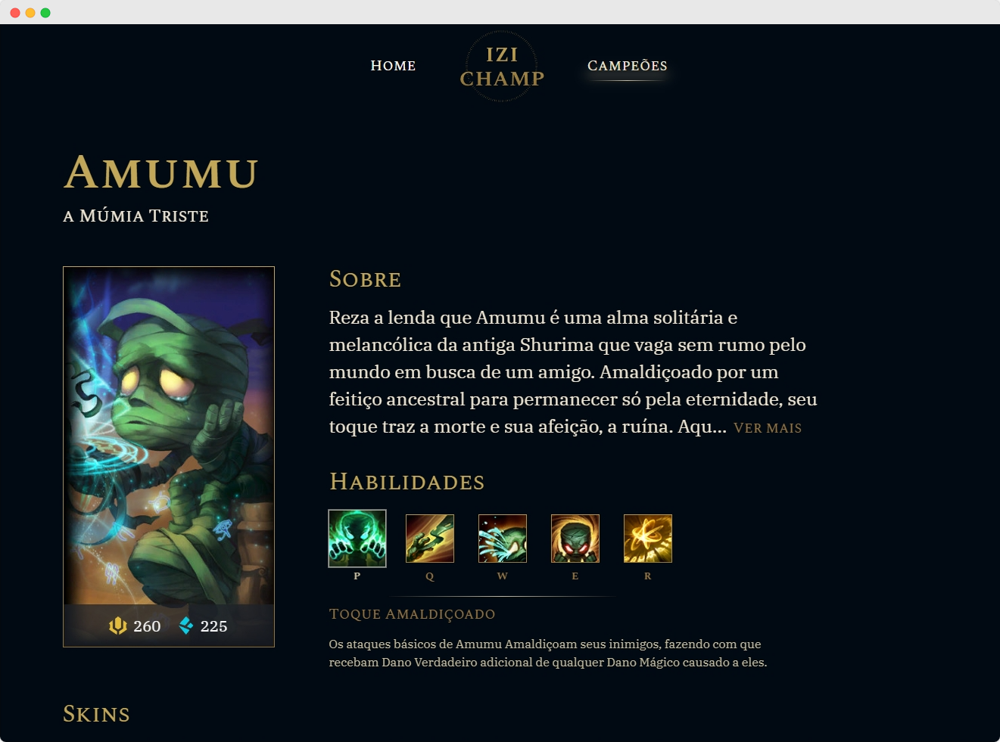

<h1 align="center" style="font-weight: bold;">Izichamp 💻</h1>

<p align="center">
  <a href="#layout">Layout</a> • 
  <a href="#tech">Technologies</a> •
  <a href="#started">Getting Started</a>
</p>

<p align="center">
    <b>Simulate your shopping cart for League of Legends champions and skins.</b>
</p>

<p align="center">
     <a href="https://izi-champ.vercel.app/">📱 Visit this Project</a>
</p>

<h2 id="layout">🎨 Layout</h2>

<p align="center">
    
    
</p>

<h2 id="tech">💻 Technologies</h2>

- React
- Typescript
- Vite

<h2 id="started">🚀 Getting started</h2>

<h3>Prerequisites</h3>

- [NodeJS](https://nodejs.org/en/download)
- [Git](https://git-scm.com/downloads)

<h3>Cloning</h3>

```bash
git clone https://github.com/luizfbn/izichamp.git
```

<h3>Config .env variables</h2>

Use the `.env.example` as reference to create your configuration file `.env`

```yaml
VITE_API_URL={YOUR_API_URL}
```

<h3>Starting</h3>

```bash
cd izichamp
npm install
npm run dev
```
